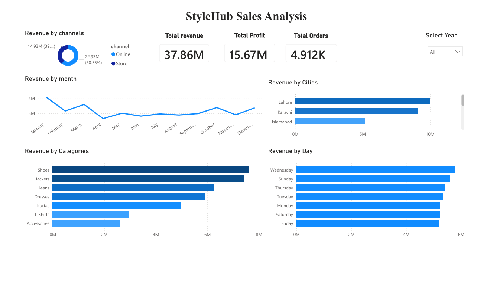

# StyleHub Sales Analysis

End to end data analysis project on two years of sales for StyleHub, a clothing brand that sells online and in stores. The project takes raw, messy sales data through cleaning in SQL, analysis, and a Power BI dashboard, and ends with clear recommendations for the business.

**Tools:** SQL for cleaning and analysis, Power BI for the dashboard, CSV flat file as the source
**Skills shown:** data cleaning, exploratory analysis, KPI design, dashboard building, turning numbers into business advice
**Process:** the six steps of data analysis, Ask, Prepare, Process, Analyze, Share and Act

## 1. Objective

StyleHub wanted to understand its sales and know where to focus next. In a real business the questions come from the stakeholders, so the first job of the analyst is to ask good questions before touching the data. These were the questions the project set out to answer:

- What products sell the best?
- When does StyleHub sell the most during the year?
- Does the website or do the stores bring more sales?
- Which cities are the strongest?
- What should the business do next?

## 2. Dataset

| Item | Detail |
| --- | --- |
| Source | One CSV flat file |
| Period | Two years of sales |
| Size | About 8,600 orders |
| Grain | One row per product per order |
| Fields used | Order date, city, sales channel, product and category, price, cost, payment type, return flag |

StyleHub is a made-up brand. The data was built to look like a real clothing business and is used to show analysis skills. No real customer data is used.

## 3. Data cleaning in SQL

The raw data was messy, like real data always is.

| Problem in the raw data | How it was handled |
| --- | --- |
| Repeated rows | Removed the duplicates |
| Category names spelled in different ways, for example "t-shirts" and "TSHIRTS" | Standardised to one clean name |
| City names with wrong spelling or spacing | Corrected |
| Blank cities and payment types | Marked as "Unknown" instead of deleting the sale |
| Zero or negative amounts | Removed, because they were mistakes |

Revenue, profit and month columns were then added so the data was ready to analyse.

## 4. Results

| KPI | Value |
| --- | --- |
| Total revenue | 37.9 million PKR |
| Total profit | 15.7 million PKR |
| Profit margin | About 41 percent |
| Total orders | 4,912 |
| Online share of revenue | 60.55 percent |
| Store share of revenue | 39.45 percent |

## 5. Key insights

1. StyleHub sells the most in winter. January is the biggest month, because the top products, Jackets and Boots, are for cold weather.
2. Shoes and Jackets make the most money, in both sales and profit. Accessories and T-Shirts sell a lot but earn very little.
3. Selling more does not mean earning more. The Baseball Cap sold the most units but made the least money, because it is cheap. Boots sold less but earned the most.
4. Most sales come from online, about 61 out of every 100 rupees.
5. Lahore and Karachi are the top cities, bringing almost half of all the money.
6. Every day of the week is about the same. People buy evenly all week.

## 6. Dashboard

A single page Power BI report so the whole business can be read in one screen:

- Cards for total revenue, total profit and total orders
- Revenue by channel, online against store
- Revenue by month, to show the winter peak
- Revenue by city for Lahore, Karachi and Islamabad
- Revenue by category for Shoes, Jackets, Jeans, Dresses, Kurtas, T-Shirts and Accessories
- Revenue by day of the week
- A year slicer to filter the whole page

## 7. Recommendations

| Question | Answer | Recommendation |
| --- | --- | --- |
| What products sell the best? | Shoes and Jackets earn the most in sales and profit, while Accessories and T-Shirts sell a lot but earn very little | Put the most money and effort into Shoes and Jackets, and use cheap items like Accessories to bring customers in, not to make profit |
| When does StyleHub sell the most? | Sales are highest in winter and January is the biggest month, because Jackets and Boots sell in the cold | Stock up before winter and spend the most on marketing in those months |
| Website or stores? | The website brings about 61 out of every 100 rupees, more than the stores | Make the website the main focus, because that is where most sales happen |
| Which cities are strongest? | Lahore and Karachi together bring almost half of all the money | Focus delivery and marketing on Lahore and Karachi first |
| What next? | The biggest wins are in the top products, the winter season, the website and the two main cities | Build stock and marketing around Shoes and Jackets before winter, push the online store hardest, and focus on Lahore and Karachi |

This puts the effort where the money already is.

## 8. Project files

| File | What it is |
| --- | --- |
| [stylehub_SQL.sqbpro](stylehub_SQL.sqbpro) | SQL project holding the cleaning and analysis queries |
| [StyleHub_Sales_Dashboard.pbix](StyleHub_Sales_Dashboard.pbix) | Power BI dashboard file |
| [dashboard.png](dashboard.png) | Screenshot of the dashboard |

## Author

Faizan Sheikh

- GitHub: [@faizaninsights](https://github.com/faizaninsights)
- Kaggle notebook for this project: [Case study for an e-commerce brand](https://www.kaggle.com/code/faizaninsights/case-study-for-e-commerce-brand)
